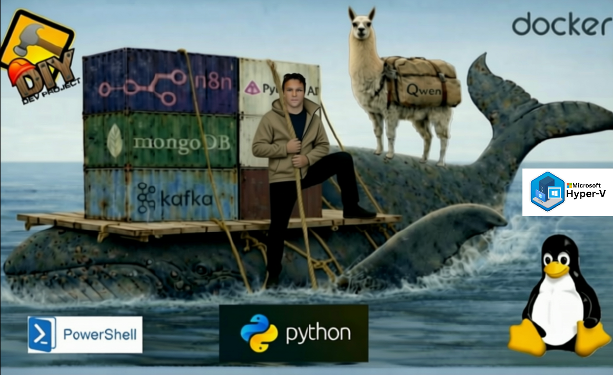

# SIGMA-AETL — Contract-First Architecture (v1.0)




**SIGMA-AETL v1.0** is a reference implementation of a **contract-first, Kafka event-driven ingestion architecture** with explicit validation boundaries, deterministic idempotency, production-grade failure isolation, and optional **private AI-assisted diagnostics via Ollama**.

This repository demonstrates how to design ingestion systems that are **correct by construction**, resilient to upstream instability, and safe to operate in production.

---

## 🔒 Contract Status

> ⚠️ **SIGMA-AETL v1.0 is contract-frozen**
>
> All schemas, validation behavior, and orchestration logic are immutable.
> Any change requires a **new versioned pipeline** (v2, v3, …).
> In-place edits are explicitly forbidden.

---

## 🧠 Architectural Overview

SIGMA-AETL is intentionally designed as a **contract-first ingestion system**, not a transformation-centric ETL pipeline.

Key principles:

- **Validation at ingestion**, not downstream
- **Explicit TRUE / FALSE routing**
- **Failures are first-class data**
- **Idempotency enforced at the application boundary**
- **AI is advisory only — never authoritative**

### High-Level Flow
```bash
Kafka (event-driven trigger)
↓
FastAPI + Pydantic Validator
↓
┌───────────────┐
│ TRUE (PASSED) │ ──▶ validated_shipments (MongoDB)
└───────────────┘
↓
┌───────────────┐
│ FALSE (FAILED)│ ──▶ failed_shipments (MongoDB)
└───────────────┘
↓
(Optional) Private AI Diagnostics via Ollama
```

Kafka is used **strictly as a transport and decoupling layer** — it is never trusted for correctness.

---

## 🧩 Core Components

### Kafka (Event-Driven Trigger)
- Durable transport layer
- Decouples producers from ingestion
- Provides ordering and replay capability
- **No validation logic**

### Validator Service
- Built with **FastAPI + Pydantic**
- Enforces immutable schema contracts
- Returns deterministic **PASSED / FAILED** responses
- Canonicalizes valid payloads
- Rejects invalid payloads with structured errors

### Orchestration (n8n)
- Consumes Kafka events
- Calls the validator
- Enforces strict TRUE / FALSE branching
- Routes records into isolated pipelines
- Workflow is frozen at v1.0

### MongoDB
- Persists validated and failed records separately
- Unique indexes enforce idempotency
- Partial indexes optimize failure queries
- Enables safe reprocessing and auditability

### AI Diagnostics (Optional)
- Powered by **private, local models via Ollama**
- Used **only in the FAILED path**
- Advisory, non-blocking, and sandboxed
- AI output is **never trusted for control flow, correctness, or persistence decisions**

---

## 🔁 Idempotency & Safety Guarantees

- Machine-generated identifiers enforce exactly-once behavior
- MongoDB unique indexes guarantee deduplication
- Kafka retries and replays are safe by design
- Failed payloads are immutable and auditable
- No partial acceptance or heuristic repair

---

## 🤖 Private AI Diagnostics (Optional)

SIGMA-AETL integrates an **optional AI diagnostics subsystem** using internal models served by **Ollama**.

- Model example: `qwen2.5:7b`
- Runtime: local, private, offline-capable
- Role: diagnostics only
- Authority: **none**

AI diagnostics may:
- Explain validation failures
- Identify probable root causes
- Suggest remediation steps

AI diagnostics **cannot**:
- Approve invalid data
- Modify payloads
- Influence routing decisions
- Block ingestion

AI acts as an **observer, not an actor**.

---

## 📁 Repository Structure (High-Level)

docs/ → architecture notes, setup, diagnostics, troubleshooting
schemas/ → frozen Pydantic contracts (v1.0)
orchestration/ → n8n workflows (contract-frozen)
validator/ → FastAPI + Pydantic validator service
scripts/ → MongoDB indexes and example payloads
deployment/ → local Docker-based experimentation only


---

## 🚀 Getting Started

This repository is designed to be reproducible on a **Windows 11 + Docker + WSL2** environment.

👉 Start here:
- `docs/setup.md` — system requirements & installation sequence
- `docs/quickstart.md` — minimal smoke tests
- `orchestration/n8n/` — frozen workflow import
- `schemas/v1/` — immutable contracts

---

## ❌ What This Architecture Intentionally Avoids

- Kubernetes
- Spark
- Airflow
- Cloud lock-in
- External AI APIs
- Implicit schema evolution

This is a **self-contained, reproducible reference architecture**.

---

## 📌 Design Intent

SIGMA-AETL is optimized for environments where:

- Upstream schemas change unexpectedly
- Replays and retries are unavoidable
- Data correctness matters more than throughput
- Failures must be explainable, not hidden
- Contracts must be enforced, not implied

---

## 👤 Author

Designed and implemented by **Ferruccio Guicciardi**

*Contract-first ingestion • Deterministic pipelines • Data engineering • Private AI systems*

---

## 📜 License

MIT License — published for **knowledge sharing, reproducibility, and architectural clarity**.

This repository is a **reference implementation and educational architecture demo**.  
It is not intended to be deployed as-is without review.

---

## 🏷️ Release

**v1.0.0-contract-frozen**

This release represents a fully validated, production-grade contract-first ingestion architecture.


